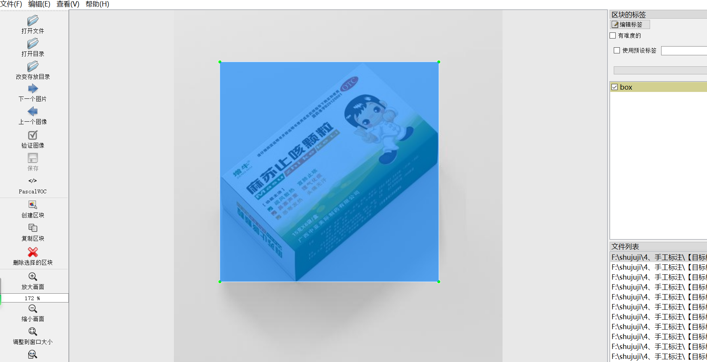
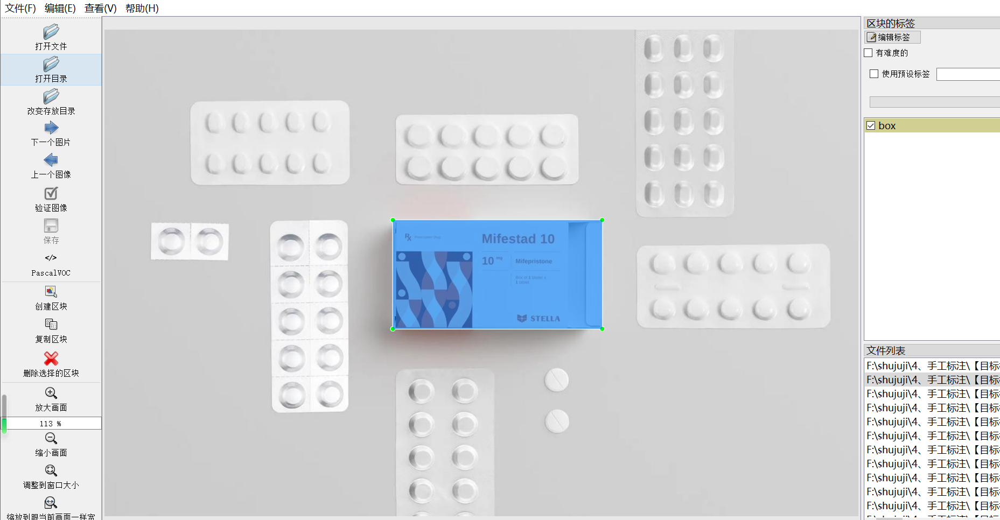
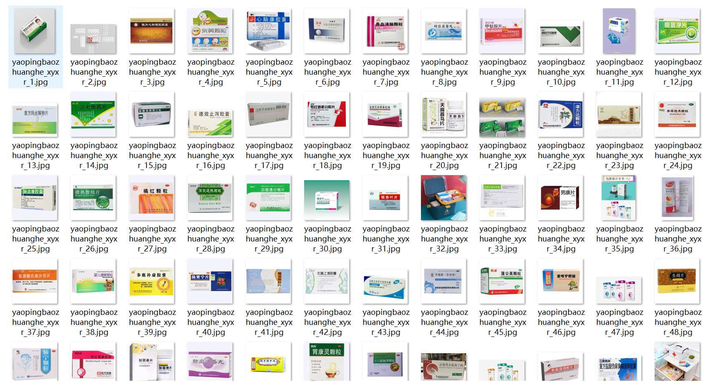
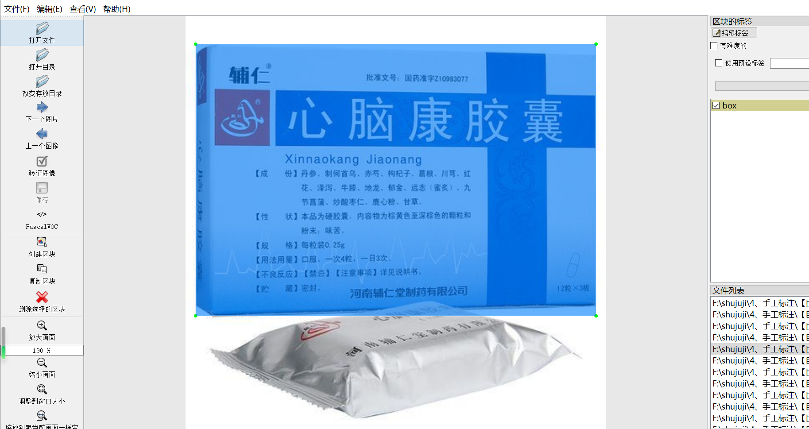

# [Object Detection Dataset] Medicine Packaging Box Dataset 1032 imagesVOC+YOLO format

Medicine packaging boxes are crucial for ensuring the quality and safety of medicines. They employ specific materials and processes to enclose the medicines, along with labeling them with information such as name, specifications, dosage, usage, and contraindications. There are various types of medicine packaging boxes, including plastic bottles, glass bottles, aluminum foil bags, and blister packs, each with its unique features catering to different drug packaging needs.

In addition to protecting the medicine from external environmental influences, these boxes also possess moisture-proofing, light protection, and sealing functions to ensure the stability and efficacy of the medicine. Some packaging boxes also come equipped with anti-counterfeit labels and child safety locks to enhance the safety of the medicine and consumer trust.

The design of medicine packaging boxes also prioritizes environmental friendliness, aiming to attract consumers' attention and reduce environmental pollution. In summary, medicine packaging boxes play a vital role in safeguarding the quality and safety of medicines and are an indispensable part of the drug circulation and use process.

Today, we introduce the Medicine Packaging Box dataset consisting of 1032 VOC+YOLO format images:

Data format: Pascal VOC format + YOLO format (without splitting paths into txt files, only containing jpg images, corresponding VOC format xml files, and yolo format txt files)

Number of images (jpg file count): 1032

Number of annotations (xml file count): 1032

Number of annotations (txt file count): 1032

Number of annotation categories: 1

Annotation category names: ["box"]

Number of bounding box instances per category:

Box instances = 1468

Total bounding box instances: 1468

Annotation tool used: labelImg

Annotation rules: drawing rectangular bounding boxes for categories

Important note: The images were manually crawled from the web and organized for annotation, which is original content and should not be copied without permission.

Image preview:

Annotation example:

## Images

---

Here is a pay link on Stripe (https://buy.stripe.com/3cs8yP7sY87d0vu9AB). Please contact me lonlonago@foxmail.com after funding $89, and I will send you a complete data files, thank you!

